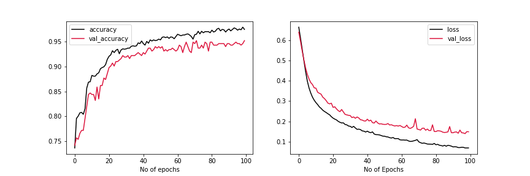
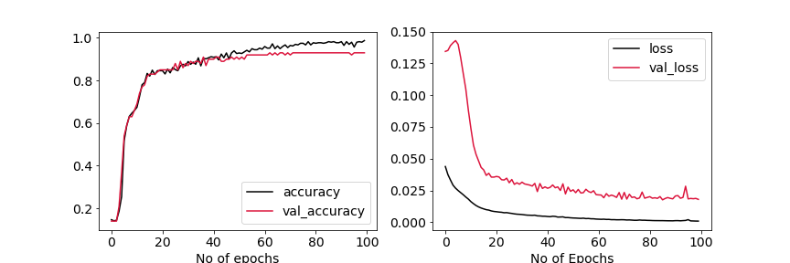
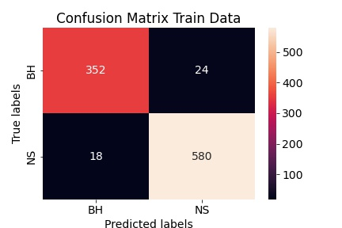

# Classification 

Now that we have done analysis over globular clusters , weh know the distribution of flux from globular cluster x-ray sources , we can use that to indentify the quiscent sources , or at least say with certain confidance which sources (or which observation) are not in burst state.

We will feed only those observation for training data.

we have the confirmed classification of sources which are both in quiscent state , for those sources , we will pick out the catalogue in which observations are made when the fluxs are less than certain threshold (mean of globular cluster sources flux)

We can consider each observation as distinct source for training.

## Classes Considered

```
LMXRB Black Holes 
LMXRB Neutron Star
CV
Pulsars
```
## LMXRB BH 
All classes - LMXRB x-ray binary Black Hole
```
Number of sources - 123
Number of Observations - 1100
observation Meeting critrion - 824

```
### Catalogues 

```
RITTERLMXB        
NGC3115CXO          
INTREFCAT          
XRBCAT             
WGACAT              
SAXWFCCAT           
SAXWFCCAT2          
```


## LMXRB NS
All classes - LMXRB X-ray binary pulsars


```
Number ofsources - 229
Number of Observations - 1268
observations meeting criteria - 971

```

### Catalogues

```
XMMSSCLWBS          
IBISCAT             
RITTERLMXB         
INTREFCAT           
RASS2MASS           
XRBCAT              
WGACAT               
SMCWINGCXO           
SAXWFCCAT           
```

## CV

```
Number of sources - 322 
Number of observations - 3609
observation meeting criteria - 2604
```
### Catalogues 
```
GC47TUCCXO          
XMMSLEWCLN           
M31CFCXO             
RASS2MASS            
XMMSSCLWBS           
IBISCAT              
INTREFCAT             
WGACAT                
NGC6791CXO            
CHICAGOCXO            
M31CXO2               
INTVARCAT             
INTIBISASS            
INTIBISGAL            
RASS6DFGS             
RASSUSNOID            
RBS                   
M83XMM                
RASSCNDINS            

```

# Data Pre-procesing 

> All filters are average combined for flux

> Dropped all empty rows and all empty columns

> $-log_{10}{flux}$ is used 

> All data columns are normalised 

> Data columns distributions are normalised $(x_i-mean)/var$

> Nan Values are imputed with 0 

# Data Filtering 

| Filter                | criteria |
|-----------------------|-----------|
| streak_src_flag       | False     |
| pileup_flag           | False     |
| mstr_streak_src_flag  | False     |
| Flux value            | < $10^{-12} erg/cm^2/s$ |
| Significance          | > 20      |


> Removed pile-up detections

> Removed **streak_src_flag = True** sources 

> Removed **pileup_flag=True** sources 

> Reomved **mstr_streak_src_flag = True** sources

> Selected sources/observations with flux only below **$10^{-12} erg/cm^2/s$**

> Selected sources only where **significance >20**
---

# Parameters Used 

* FLux
* Variability
* Hardness
* Model Fit

## X-ray binary (NS+BH) Vs CV 


```
Training Accuracy - 88.6 %
Test Accuracy - 88.3 %
```


## NS vs BH


```
Training Accuracy - 96%
Test Accuracy - 91 %
```

